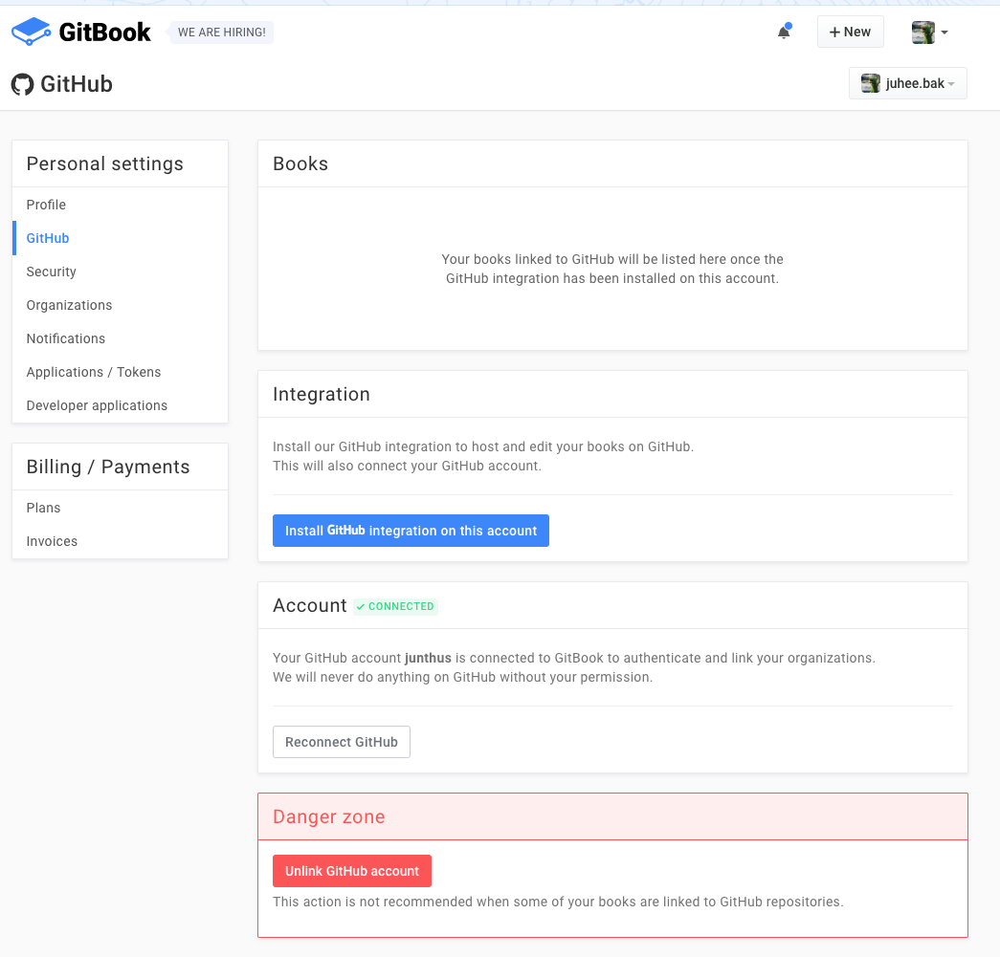

 뀨

# 깃북이 머여
문서작성 + 호스팅 플랫폼. npm을 기반으로 한 플러그인 마켓이 있어서 여러 기능을 끌어다 쓰기 편하다(만 찾기는 좀 힘들다). 기본으로 제공하는 검색창, [사용자 의견받기](https://www.gitbook.com/blog/features/discussions), pdf 다운로드 지원등이 매우 편리함. 
* SaaS 로만 제공하는 [단호박](https://help.gitbook.com/basics/can-i-run-gitbook-on-premise.html). github.io 가 있어서인듯.
* [데스크탑 에디터](https://www.gitbook.com/editor)가 있긴 한데 마크다운 편집기가 구타유발툴이라 npm 설치를 추천. (gitbook 코어가 버전이 여러개이기도 하고)
```bash
$ npm install gitbook-cli -g
```

* cli는 이런 명령어를 지원
    * `$ gitbook init (./newDir)` 기본 파일 생성
    * `$ gitbook build` 빌드
    * `$ gitbook serve` 로컬 서버 + 변경사항 watch => 빌드 & 리프레시 지원, `_book` 디렉터리에 빌드 결과물 업데이트.
    * `$ gitbook install` plugin 설치

# 어케 만듬
* 파일 컨벤션
    * README.md (필수)
    * SUMMARY.md (toc용)
    * GLOSSARY.md (용어집 - 자동 색인되어 문서에서 링크되어서 보여짐)
    * book.json (gitbook 설정)
    * cover.jpg, cover_small.jpg (커버이미지라는데 아직 확인 못함)

* 원격저장소
    * 그냥 올리면 된다. `origin master` 최고. [예시](https://github.com/junthus/test)
    * 깃북 셋팅에서 다른 브랜치로도 지정 가능.

* 멀티 링구얼 문서
    * 폴더 구조로 대응 가능.

# 어또케 호스팅 ?
* 깃헙 계정 + repo 필요 (org에 문서를 호스팅하려는 경우 그 계정으로 로긴해야 한다.)
* https://www.gitbook.com/ 접속, 깃헙 계정으로 로긴하면 이메일로 컨펌이 온다. 그걸 누르면 아래 페이지로 감.

* Integration - 버튼 클릭 > 깃북용 리포 선택 > install gitbook
* Account - 깃헙 계정 연동
* 위의 두 가지를 하고 나면 Books 메뉴에 create 메뉴가 생김. 
* 끗. [예시](https://www.gitbook.com/book/juhee-bak/whale-ext/details)

# 커스텀하기
* 플러그인(npm) 설치/제작 - https://plugins.gitbook.com/
    * 플러긴 관리 : book.json에 이름 넣고 `git install` 하면 설치해주는데 지우는 커멘드가 안 보임
        * 어차피 npm이므로 `gitbook-plugin-${이름}`으로 package.json 따로 관리하는게 나을듯.
    * 이 gitbook에 설치해본거
        * search-pro - 검색 highlight
        * prism - syntax highlight
        * codepen - 무료라 혹했는데 플러긴이 바보 되어있음 ㅠㅠ
        * jsbin - pro 계정 필요
        <a class="jsbin-embed" href="https://jsbin.com/tayevipusi/embed?html,js,output">JS Bin on jsbin.com</a><script src="https://static.jsbin.com/js/embed.min.js?4.1.1"></script>
        * 테마도 플러긴으로 바꿔볼까 했는데 아직 테마 마켓은 성숙하지 않은듯...

### 그러므로 테마는 직접 야매로 바꾸는게 낫습니다.
* css 수정 - `styles/website.css`
* layout 수정 - `_layout/website/...`
    * 템플릿 언어 : [nunjucks](https://mozilla.github.io/nunjucks/)
    * 구조 참고 : [GitbookIO/theme-default](https://github.com/GitbookIO/theme-default)
* 양 많아지면 걍 플러그인 행이 나을듯.

# See More
* [gitbook toolchain doc](https://www.gitbook.com/book/gitbookio/docs-toolchain/details)

